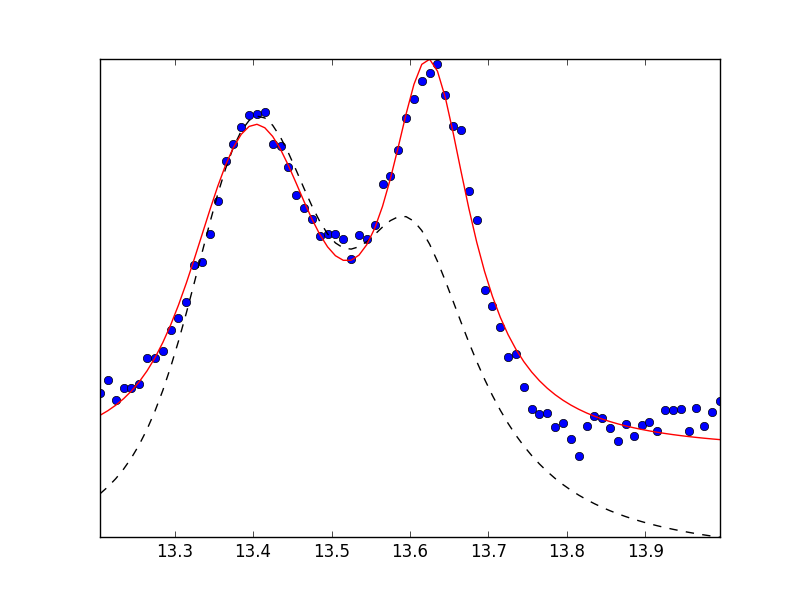
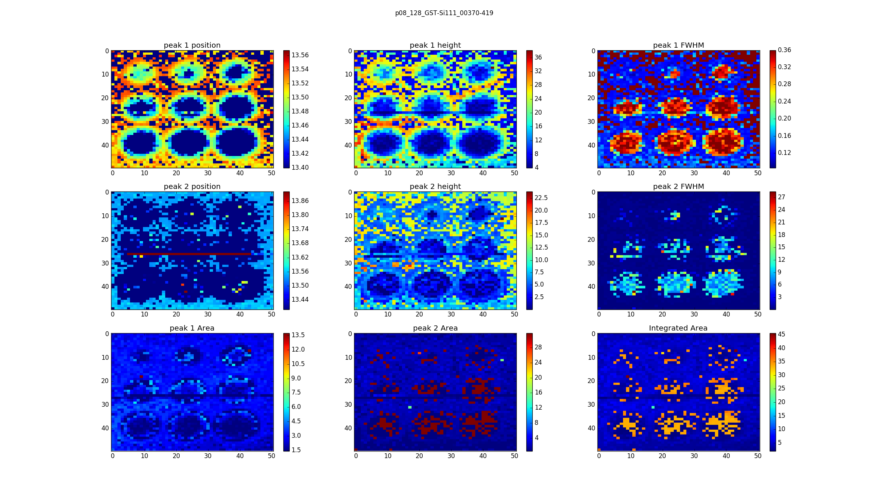
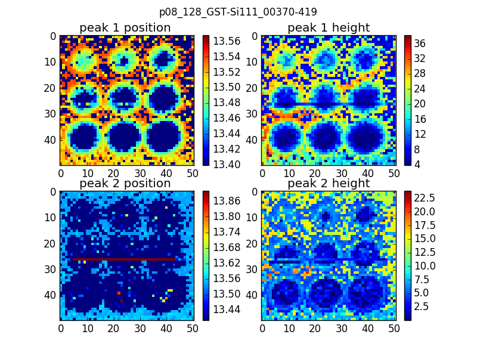

# 2Dimages
To read 2 Dimensional Perkin Elmer images and analyse the data 

1)Takes a series of 2D perkin Elmer images from different directories. 
2)reads all the files in the folder and extracts the theta over a certain range (sorting of the files was done using glob2 library)
3)plot the data 
4)analyse the data using curve fit method (linear fit for background subtraction, pseudo-voigt and gaussian fits for the double peaks)
5)Outputs the fitting parameters as a 2D image giving the positional information of the peak and the height information

Tips:
  In case of single peaks or very weak double peak, please go for single peak fitting option to speed up the processing/execution time
Example of a double peak fit

Example of the plot

